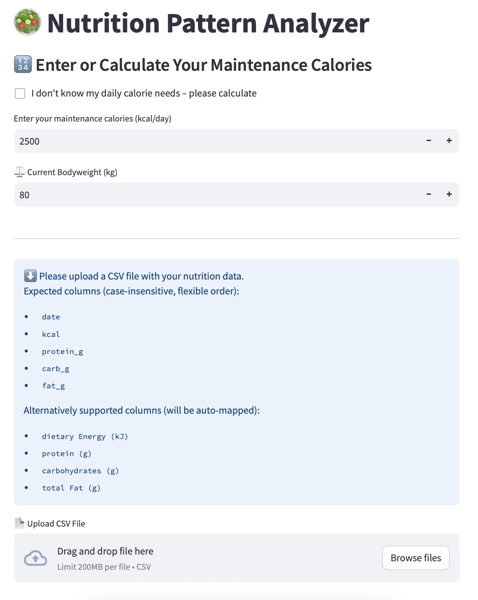
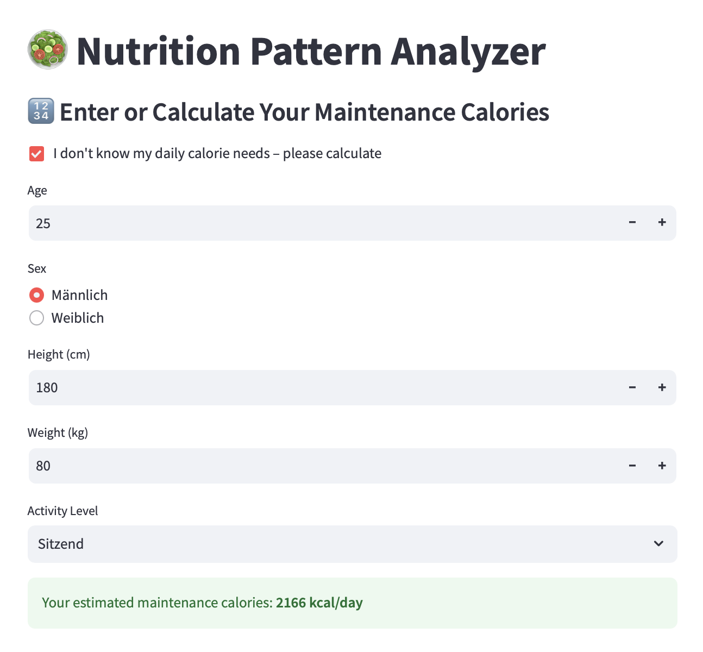
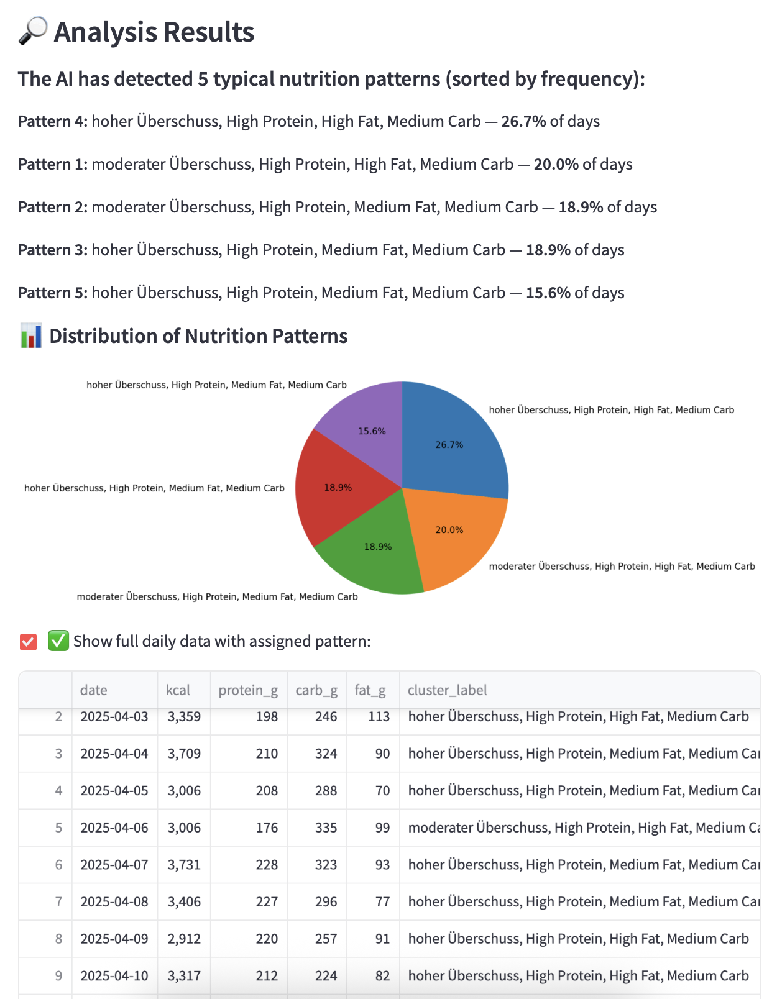

# 🥗 Nutrition Cluster Analyzer

A Streamlit-powered application to **analyze, cluster, and visualize daily nutrition data** using machine learning.  
Upload your food tracking data (e.g. from Cronometer, Apple Health, etc.), and the app will detect common dietary patterns such as calorie surplus, protein distribution, and macronutrient balance.

---

## 🚀 Features


✅ Upload your own CSV nutrition data  
✅ Automatically preprocess and normalize data  
✅ Calorie need calculation (Harris-Benedict formula)  
✅ KMeans clustering with optimal `k` selection  
✅ Automatic labeling of eating patterns  
✅ Visual summaries of the patterns found  
✅ Optional dataframe output with cluster assignments  
✅ Configurable thresholds via `config.yaml`  

---

## 📊 Example Output

> The app identifies typical daily patterns such as:

- **"Moderate Deficit, High Protein, Medium Fat, Medium Carb"**
- **"High Surplus, Low Protein, High Fat, Low Carb"**
- etc.

You’ll see:
- A list of patterns sorted by frequency  
- A pie chart summarizing the cluster distribution  
- An optional full table of your nutrition days labeled by cluster

---

## 📸 Demo

Here’s how the app looks in action:





---

## 🗂️ Project Structure

```
nutrition-cluster-analyzer/
│
├── config/
│   └── config.yaml                         ← Thresholds for labeling logic
│
├── data/
│   └── diet_data.csv                       ← Sample or user-provided input data
│
├── images/
│   ├── analysis_results.png     
│   ├── maintenance_calorie_calculator.png     
│   └── start_screen.png     
│
│
├── src/
│   ├── app.py                              ← Streamlit frontend
│   ├── main.py                             ← Pipeline entry point
│   ├── preprocessing.py                    ← Data loading & cleaning
│   ├── clustering.py                       ← Standardization & KMeans
│   ├── labeling.py                         ← Rule-based cluster labeling
│   ├── calorie_calculator.py               ← BMR & maintenance kcal calculation
│   ├── visualization.py                    ← Optional feature plots
│   └── debug.py                            ← Dev/testing script (optional)
│
├── requirements.txt                        ← Python dependencies
└── README.md                               ← You’re reading it!
```
---

## ⚙️ Configuration

All thresholds for labeling (e.g., what counts as "low fat") are defined in:

`config/config.yaml`

This allows for easy adjustment of what defines a surplus, deficit, or macro range.

---

## 🧠 Clustering & Labeling Logic

- **Clustering:** KMeans with standardized features (`kcal`, macronutrient percentages)  
- **Optimal k:** Determined using the Elbow method (`kneed` library)  
- **Labeling:** Based on:  
  - `kcal` vs. maintenance kcal (for surplus/deficit)  
  - grams per kg bodyweight for protein, fat, and carbs

---

## 📁 Input Format

Your CSV file should include daily nutrition values. Supported column headers (case-insensitive and flexible):

- `Date`
- `Dietary Energy (kJ)` — will be automatically converted to `kcal`
- `Protein (g)`
- `Carbohydrates (g)`
- `Total Fat (g)`

---

## ▶️ How to Run

### 🖥️ Start the app
```bash
streamlit run src/app.py
```

---

## 💡 Example Use Cases

- Personal diet pattern recognition  
- Diet coaching insights  
- Detecting trends over weeks/months  
- Identifying inconsistent nutrition behavior  

---

## 🛠️ Technologies Used

- Python 🐍  
- Streamlit 🌐  
- Pandas / Scikit-learn 📊  
- Matplotlib / Seaborn 📈  
- YAML config support  

---

## 📌 To-Do / Future Improvements

- Add trend detection over time  
- Enable filtering by weekday or training day  
- Add import for Apple Health & Cronometer JSON formats  
- Export summary PDF or dashboard  

---

## 🤝 Contributing

Feel free to fork and adapt the labeling logic or clustering approach to your use case.  
Pull requests are welcome!

---

## 📄 License

MIT License – use freely for personal or commercial projects.